# Absolute Sports
## Aplikasi football shop saya dapat di akses di link berikut: https://fakhri-husaini41-absolutesports.pbp.cs.ui.ac.id/ 

Nama Aplikasi: Absolute Sports\
Nama: Fakhri Husaini Romza\
NPM: 2406436972\
Kelas: PBP C

### 1. Jelaskan bagaimana cara kamu mengimplementasikan checklist di atas secara step-by-step (bukan hanya sekadar mengikuti tutorial).
   1. Membuat proyek Django
      Saya membuka terminal pada direktori kerja lalu menjalankan perintah `django-admin startproject absolute_sports` untuk membuat struktur proyek dasar. Perintah ini menghasilkan file `manage.py` beserta folder absolute_sports yang berisi file konfigurasi seperti settings.py, urls.py, dan lainnya. Setelah itu, saya membuat virtual environment baru menggunakan `python -m venv venv` dan mengaktifkannya dengan perintah `venv\Scripts\activate`. Langkah berikutnya adalah menginstal Django beserta dependensi lain yang tercantum dalam `requirements.txt` menggunakan perintah `pip install -r requirements.txt`.
      
   2. Membuat aplikasi bernama main
      Setelah berada di dalam direktori proyek, saya menjalankan perintah `python manage.py startapp main` untuk membuat aplikasi baru. Perintah ini menghasilkan sebuah folder bernama main yang berisi beberapa file standar seperti `models.py`, `views.py`, `urls.py`, dan `admin.py` yang nantinya digunakan untuk mengatur logika aplikasi, struktur data, serta konfigurasi admin. Agar aplikasi ini terintegrasi dengan proyek utama, saya menambahkan 'main' ke dalam daftar INSTALLED_APPS di file settings.py. Dengan begitu, Django mengenali aplikasi main sebagai bagian dari proyek dan siap digunakan dalam pengembangan lebih lanjut.
   
   3. Melakukan routing pada proyek agar dapat menjalankan aplikasi main
      Pada file `urls.py` , saya menambahkan konfigurasi routing dengan mengimpor include dari django.urls. Setelah itu, saya menambahkan baris `path('', include('main.urls'))` sehingga setiap permintaan ke root URL diarahkan ke file urls.py milik aplikasi main. Dengan cara ini, rute utama proyek secara otomatis dipetakan ke dalam sistem routing aplikasi main.
   
   4. Membuat model pada aplikasi main dengan nama Product dan memiliki atribut wajib
      di models.py saya definisikan `Product(models.Model)` dengan atribut sebagai berikut:
      ```
      name = models.CharField(max_length=255)
      price = models.IntegerField()
      description = models.TextField()
      category = models.CharField(max_length=20, choices=CATEGORY_CHOICES, default='update')
      thumbnail = models.URLField(blank=True, null=True)
      is_featured = models.BooleanField(default=False)
      ```
      Lalu, Saya menjalankan perintah `python manage.py makemigrations` untuk membuat berkas migrasi berdasarkan model yang telah didefinisikan di aplikasi main. Setelah itu, saya mengeksekusi `python manage.py migrate` agar migrasi tersebut diterapkan ke database.

   5. Membuat fungsi pada views.py untuk dikembalikan ke template HTML yang menampilkan nama aplikasi serta nama dan kelas:
      Di main/views.py, buat fungsi show_main(request):
      ```
      from django.shortcuts import render
      
      def show_main(request):
          context = {
              'npm' : '2406436972',
              'name': 'Fakhri Husaini Romza',
              'class': 'PBP B'
          }

          return render(request, "main.html", context)
      ```

   6. Membuat sebuah routing pada urls.py aplikasi main
      ```
      from django.urls import path
      from main.views import show_main

      app_name = 'main'

      urlpatterns = [
          path('', show_main, name='show_main'),
      ]
      ```

  7. Melakukan deployment ke PWS
     ```
     git add .
     git commit -m "Tugas 2: Django MVT impementations"
     git push origin master
     git push pws master
     ```
### 2. Buatlah bagan yang berisi request client ke web aplikasi berbasis Django beserta responnya dan jelaskan pada bagan tersebut kaitan antara urls.py, views.py, models.py, dan berkas html.
   

1. User mengakses suatu URL tertentu pada browser (request).
2. Django akan memetakan URL (routing) tersebut ke View melalui urls.py.
3. View mengambil dan memproses data dari Model apabila dibutuhkan.
4. Output dari View ditampilkan ke pengguna dengan cara dikirim ke Template (html)

Referensi adalah PPT 03 - MTV Django Architecture:
https://drive.google.com/drive/folders/1St8NywVbAFIgZ1AWCbe6VMmZZj2_BzR_?usp=sharing 
   
### 3. Jelaskan peran settings.py dalam proyek Django!
   settings.py adalah file konfigurasi proyek Django. Peran-perannya adalah:
   1. Pengaturan database
   2. Static files dan template.
   3. Keamanan, seperti SECRET_KEY, DEBUG, ALLOWED_HOSTS
   4. Konfigurasi proyek, seperti nama aplikasi di INSTALLED_APPS, pengaturan middleware, dan pengaturan root URL

### 4. Bagaimana cara kerja migrasi database di Django?
   Migrasi database di Django adalah proses yang menghubungkan perubahan pada model di `models.py` dengan struktur database. Saat developer membuat atau mengubah model, perintah `python manage.py makemigrations` digunakan untuk menghasilkan file migrasi yang berisi instruksi perubahan skema database. Selanjutnya, perintah `python manage.py migrate` mengeksekusi file migrasi tersebut ke database sehingga struktur database selalu selaras dengan definisi model.

### 5. Menurut Anda, dari semua framework yang ada, mengapa framework Django dijadikan permulaan pembelajaran pengembangan perangkat lunak?
   1. Dengan pola MTV (Model-Template-View), Django memudahkan pemula memahami hubungan antara logika aplikasi, pengelolaan data, dan tampilan antarmuka.
   2. Django memiliki banyak fitur bawaan, seperti autentikasi, sistem admin, manajemen URL, dll.
   3. Dokumentasi lengkap.
   4. Django banyak digunakan di industri.

### 6. Apakah ada feedback untuk asisten dosen tutorial 1 yang telah kamu kerjakan sebelumnya?
   Tutorial 1 sangat membantu. catatan-catatan yang ada juga sangat berguna ketika ada error. Penjelasan yang ada juga sudah sangat jelas.


## Tugas 3

### 1. Jelaskan mengapa kita memerlukan data delivery dalam pengimplementasian sebuah platform?
   Data delivery diperlukan karena platform modern hampir lalu bergantung pada pertukaran data antara komponen internal maupun dengan pihak eksternal. Data delivery yang efisien menjamin ketersediaan data tepat waktu. Data delivery yang bagus memastikan komponen-komponen aplikasi berinteraksi dengan lancar. Data delivery juga mencakup enkripsi, autentikasi, dan otorisasi agar data yang dikirim tidak bocor atau diakses pihak yang tidak berwenang.

### 2. Menurutmu, mana yang lebih baik antara XML dan JSON? Mengapa JSON lebih populer dibandingkan XML?
   Menurut saya, JSON lebih baik dibandingkan XML. JSON lebih populer karena strukturnya lebih ringkas dan berbasis key dan value, lebih mudah dibaca, dan ukuran datanya lebih kecil.

### 3. Jelaskan fungsi dari method is_valid() pada form Django dan mengapa kita membutuhkan method tersebut?
   Fungsi dari `is_valid()` adalah untuk memvalidasi form, mengecek apakah semua field pada form diisi dengan benar sesuai aturan, jika error akan return False. Method `is_valid()` juga mengisi `cleaned_data` yang berisi data input yang sudah dibersihkan dan siap dipakai. Method is_valid() juga menangani error handling.

### 4.  Mengapa kita membutuhkan csrf_token saat membuat form di Django? Apa yang dapat terjadi jika kita tidak menambahkan csrf_token pada form Django? Bagaimana hal tersebut dapat dimanfaatkan oleh penyerang?
   csrf_token adalah token unik yang dibuat Django dan disematkan pada setiap form HTML. Fungsi dari csrf_token adalah untuk mencegah serangan Cross-Site Request Forgery. Jika tidak menambahkan csrf_token, maka Form Django tidak terlindungi dari serangan CSRF. Penyerang dapat memanfaatkan kelemahan itu dengan melakukan serangan CSRF, misalnya pada aplikasi e-banking, user sudah login ke aplikasi, penyerang membuat halaman berisi form palsu di website lain, user tanpa sadar mengunjungi halaman milik penyerang, form palsu terkirim ke server bank dengan cookie session milik user, akhirnya uang user akan terkirim ke rekening penyerang.

### 5. Jelaskan bagaimana cara kamu mengimplementasikan checklist di atas secara step-by-step (bukan hanya sekadar mengikuti tutorial).
   Checklist 1:
   Mengimport `HttpResponse` dan `Serializer`
   
   Lalu, buat fungsi-fungsinya.
   di `urls.py` pada direktori main import fungsi-fungsi yang sudah dibuat 
   `from main.views import show_main, create_product, show_product, show_xml, show_json,  show_xml_by_id, show_json_by_id`
   Tambahkan path url ke urlpatterns agar bisa mengakses fungsi yang sudah diimpor.

   
   Checklist 2:
   

   Checklist 3-5:
   Sebelum membuat form, harus membuat skeleton terlebih dahulu. Pertama, buat direktori templates pada direktori utama dan buat file `base.html`, isi dari base.html adalah:
   

   Buka settings.py pada direktori proyek, lalu tambahkan pada `TEMPLATES` `'DIRS': [BASE_DIR / 'templates']`

   Untuk membuat form input, buat file baru di main bernama `forms.py`, isi forms.py adalah:
   

   Sesuaikan fields main.models, model, dan fields dengan `models.py`

   Buka file `views.py` pada direktori `main` dan tambahkan import dan fungsi-fungsi:
   

   Buka `urls.py` pada main, import fungsi-fungsi dan tambahkan path URL ke urlpatterns:
   
   

   Buka `main.html` di direktori `main/templates` dan tambahkan blok content data product dan tombol Add Product:
   

   Lalu buat dua berkas HTML, `create_product.html` dan `product_detail.html`, pada direktori `main/templates` 
   
   

   Buka settings.py di root, lalu tambahkan `CSRF_TRUSTED_ORIGINS` tepat setelah `ALLOWED_HOSTS`
   tambahkan url proyek pws:
   

   Yang membedakan dari tutorial adalah saya mengganti fungsi `created_at` dengan `price` di `main.html` dan `product_detail.html` 
   

   Saya juga mengubah semua `News` atau `news` dengan `Product` atau `product`
   
### 6. Apakah ada feedback untuk asdos di tutorial 2 yang sudah kalian kerjakan?
   Tutorial sudah sangat bagus. Semua penjelasan dapat dipahami dengan mudah dan runtut.

### 7. Mengakses keempat URL di poin 2 menggunakan Postman,
   JSON:
   

   XML: 
   

   JSON by id:
   

   XML by id:
   

## Tugas 4
### 1. Apa itu Django AuthenticationForm? Jelaskan juga kelebihan dan kekurangannya.
   AuthenticationForm adalah form di Django yang digunakan untuk melakukan login.
   Kelebihan:
   1. Sudah terintegrasi langsung dengan Django.
   2. Aman, AuthenticationForm menangani validasi dan melindungi aplikasi dari sekarangseperti CSRF.
   3. Error handling

   Kekurangan:
   1. Kurang fleksibel untuk kustomisasi.
   2. Sulit untuk mengimplementasikan fitur-fitur kompleks.

### 2. Apa perbedaan antara autentikasi dan otorisasi? Bagaiamana Django mengimplementasikan kedua konsep tersebut?
   1. Autentikasi adalah suatu proses di mana identitas pengguna di verifikasi.
   2. Otorisasi adalah suatu proses yang dilakukan setelah autentikasi, yaitu untuk menentukan hak akses pengguna.
   3. Django mengimplementasikan autentikasi dengan fungsi-fungsi seperti AuthenticationForm. Otorisasi dengan menggunakan is_superuser atau is_staff, @login_required, @permission_required.

### 3. Apa saja kelebihan dan kekurangan session dan cookies dalam konteks menyimpan state di aplikasi web?
   Kelebihan session:
   1. Ideal untuk Single Page Applications (SPA) dan aplikasi mobile.
   2. Lebih scalable untuk aplikasi berukuran besar.
   3. Dapat digunakan di berbagai domain.
   Kekurangan session:
   1. Rentan akan Cross-Site Scripting (XSS) Injection.
   2. Programmer perlu secara manual menghandle penyimpanan, pengambilan, dan inklusi dari token di HTTP request.

   Kelebihan cookies:
   1. Browser menghandle penyimpanan dan transmisi cookie.
   2. Cookie dapat dibuat lebih aman dengan atribut seperti HttpOnly, Secure dan SameSite.
   Kekurangan cookies:
   1. Rentan akan serangan Cross-Site Request Forgery (CSRF).
   2. Terbatas pada penggunaan browser.

### 4. Apakah penggunaan cookies aman secara default dalam pengembangan web, atau apakah ada risiko potensial yang harus diwaspadai? Bagaimana Django menangani hal tersebut?
   Seperti yang dijelaskan di soal sebelumnya, cookies tidak sepenuhnya aman, karena ia rentan akan serangan Cross-Site Request Forgery (CSRF) dan Cross-Site Scripting. Django menangani masalah tersebut dengan menggunakan HttpOnly=True, Secure=True, CSRF token, dll.

 ### 5. Jelaskan bagaimana cara kamu mengimplementasikan checklist di atas secara step-by-step (bukan hanya sekadar mengikuti tutorial).
   Checklist 1:
   Langkah pertama adalah mengaktifkan virtual environment dengan command `env\Scripts\activate` di terminal. Di `views.py` tambahkan fungsi register. 
   import fungsi berikut di `views.py`
   ```
   from django.contrib.auth.forms import UserCreationForm, AuthenticationForm
   from django.contrib import messages
   from django.contrib.auth import authenticate, login, logout
   ```

   ```
   def register(request):
    form = UserCreationForm()

    if request.method == "POST":
        form = UserCreationForm(request.POST)
        if form.is_valid():
            form.save()
            messages.success(request, 'Your account has been successfully created!')
            return redirect('main:login')
    context = {'form':form}
    return render(request, 'register.html', context)
   ```
   Lalu, buat file `register.html` di main/templates dan file itu diisi dengan

   ```
   

   
   <title>Register</title>
   

   

   <div>
   <h1>Register</h1>

   <form method="POST">
      
      <table>
         {{ form.as_table }}
         <tr>
         <td></td>
         <td><input type="submit" name="submit" value="Daftar" /></td>
         </tr>
      </table>
   </form>

   
   <ul>
      
      <li>{{ message }}</li>
      
   </ul>
   
   </div>

   
   ```

   Lalu, untuk membuat fungsi login, buat fungsi login_user di views.py

   ```
   def login_user(request):
   if request.method == 'POST':
      form = AuthenticationForm(data=request.POST)

      if form.is_valid():
            user = form.get_user()
            login(request, user)
            response = HttpResponseRedirect(reverse("main:show_main"))
            response.set_cookie('last_login', str(datetime.datetime.now()))
            return response
   else:
      form = AuthenticationForm(request)
   context = {'form': form}
   return render(request, 'login.html', context)
   ```

   buat file baru bernama login.html di main/templates

   ```
   

   
   <title>Login</title>
   

   
   <div class="login">
   <h1>Login</h1>

   <form method="POST" action="">
      
      <table>
         {{ form.as_table }}
         <tr>
         <td></td>
         <td><input class="btn login_btn" type="submit" value="Login" /></td>
         </tr>
      </table>
   </form>

   
   <ul>
      
      <li>{{ message }}</li>
      
   </ul>
    Don't have an account yet?
   <a href="">Register Now</a>
   </div>

   
   ```

   Lalu untuk membuat fungsi logout, buat fungsi ini di `views.py` 

   ```
   def logout_user(request):
      logout(request)
      response = HttpResponseRedirect(reverse('main:login'))
      response.delete_cookie('last_login')
      return response
   ```

   di file main.html di direktori main/templates buat kode ini di bawah Add Product

   ```
   <a href="">
      <button>Logout</button>
   </a>
   ```

   di `views.py`, import dan tambahkan path url fungsi-fungsi yang sudah dibuat

   ```
   from main.views import register
   from main.views import login_user
   from main.views import logout_user
   ```

   ```
   urlpatterns = [
    
    path('register/', register, name='register'),
    path('login/', login_user, name='login'),
    path('logout/', logout_user, name='logout'),
   ]
   ```

   Checklist 2:
   aktifkan virtual enviroment dengan `env\Scripts\activate`, lalu jalankan server dengan `python manage.py runserver`. Buka localhost, lalu buat akun. Tambahkan 3 product.
   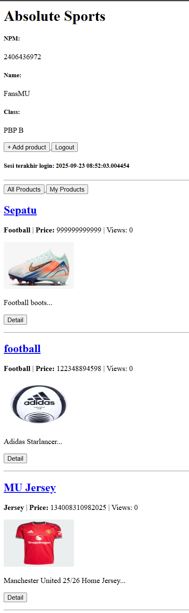
   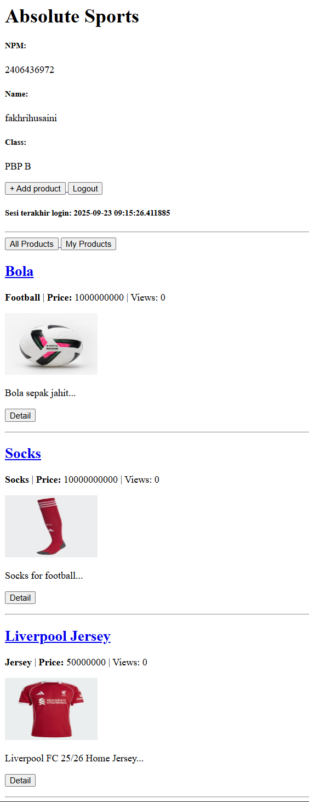

   Checklist 3:
   Buka file `models.py` lalu tambahkan baris kode ini
   `from django.contrib.auth.models import User`

   Pada model Product tambahkan:
   `user = models.ForeignKey(User, on_delete=models.CASCADE, null=True)`

   Lalu, lakukan migrasi model dengan `python manage.py makemigrations` dan `python manage.py migrate` 

   Buka views.py pada bagian create_product, ubah kode agar menjadi seperti ini:

   ```
   def create_product(request):
    form = ProductForm(request.POST or None)

    if form.is_valid() and request.method == 'POST':
        product_entry = form.save(commit = False)
        product_entry.user = request.user
        product_entry.save()
        return redirect('main:show_main')

    context = {
        'form': form
    }

    return render(request, "create_product.html", context)
   ```

   lalu, pada show_main:

   ```
   @login_required(login_url='/login')
   def show_main(request):
      filter_type = request.GET.get("filter", "all")  # default 'all'

      if filter_type == "all":
         product_list = Product.objects.all()
      else:
         product_list = Product.objects.filter(user=request.user)


      context = {
         'npm' : '2406436972',
         'name': request.user.username,
         'class': 'PBP B',
         'product_list' : product_list,
         'last_login': request.COOKIES.get('last_login', 'Never'),
      }

      return render(request, "main.html", context)
   ```

   Lalu, pada main.html tambahkan tombol filter:
   ```
      <a href="?filter=all">
         <button type="button">All Products</button>
      </a>
      <a href="?filter=my">
         <button type="button">My Products</button>
      </a> 
   ```

   tambahkan juga di product_detail.html:

   ```
   
   <p>Added by: {{ product.user.username }}</p>
   
      <p>Added by: Anonymous</p>
   
   ```

   Checklist 4:
   Buka `views.py` di subdir main, tambahkan import HttpResponseRedirect, reverse, datetime:

   ```
   import datetime
   from django.http import HttpResponseRedirect
   from django.urls import reverse
   ```

   Ubah fungsi login_user agar menyimpan cookie last_login:

   ```
   def login_user(request):
   if request.method == 'POST':
      form = AuthenticationForm(data=request.POST)

      if form.is_valid():
            user = form.get_user()
            login(request, user)
            response = HttpResponseRedirect(reverse("main:show_main"))
            response.set_cookie('last_login', str(datetime.datetime.now()))
            return response
   else:
      form = AuthenticationForm(request)
   context = {'form': form}
   return render(request, 'login.html', context)
   ```

   tambahkan di show_main kode:
   `'last_login': request.COOKIES.get('last_login', 'Never')`

   Ubah fungsi logout_user untuk menghapus last_login:
   
   ```
   def logout_user(request):
      logout(request)
      response = HttpResponseRedirect(reverse('main:login'))
      response.delete_cookie('last_login')
      return response
   ```

   Di `main.html` di main/templates tambahkan kode di setelah tombol logout:
   `<h5>Sesi terakhir login: {{ last_login }}</h5>`


## Tugas 5
### 1.Jika terdapat beberapa CSS selector untuk suatu elemen HTML, jelaskan urutan prioritas pengambilan CSS selector tersebut!
   1. Inline styles
   2. Id selectors
   3. Classes, attribute selectors, pseudo-classes
   4. Elements dan pseudo-elements
   5. Universal selector

### 2. Mengapa responsive design menjadi konsep yang penting dalam pengembangan aplikasi web? Berikan contoh aplikasi yang sudah dan belum menerapkan responsive design, serta jelaskan mengapa!
   Karena responsive design seperti namanya memberikan pengalaman website yang responsive dan lebih enak dilihat di berbagai platform, mobile, tablet, ataupun desktop. 

   Contoh aplikasi yang telah menerapkan responsive design adalah Instagram dan W3Schools dan contoh aplikasi yang tidak menerapkan responsive design adalah website SIAKNG.

   Responsive design dapat dilihat dengan menekan CTRL+SHIFT+I lalu CTRL+SHIFT+M, aspek rasio akan berubah dan akan terlihat bahwa yang sudah menerapkan responsive design akan mengikuti perubahan.

### 3. Jelaskan perbedaan antara margin, border, dan padding, serta cara untuk mengimplementasikan ketiga hal tersebut!
   Margin adalah ruang di luar elemen, Border adalah garis yang mengelilingi elemen, berada di antara margin dan padding, padding adalah ruang di dalam elemen, antara konten dan border.

   margin: 20px
   border: 2px solid purple
   padding: 10px


### 4. Jelaskan konsep flex box dan grid layout beserta kegunaannya!
   Flex box adalah sistem layout satu dimensi yang dirancang unutk mengatur elemen-elemen dalam satu baris atau kolom. Flexbox sangat berguna untuk layout yang lebih sederhana dan lebih linear, seperti menu navigasi atau form pengisian.

   Grid adalah sistem layout dua dimensi yang memungkinkan pengaturan elemen baik secara horizontal (kolom) maupun vertikal (baris) di dalam sebuah kontainer. Grid sangat berguna dalam membuat desain halaman yang lebih terstruktur dan terorganisir dengan kontrol penuh pada setiap elemen di dalamnya.


### 5. Jelaskan bagaimana cara kamu mengimplementasikan checklist di atas secara step-by-step (bukan hanya sekadar mengikuti tutorial)!
   Pertama-tama kita menambahkan tailwind ke aplikasi, buka file `base.html`, tambahkan tag `<meta name="viewport">` agar halaman menyesuaikan ukuran dan perilaku device mobile. Lalu, tambahkan script cdn tailwind di bagian head. `<script src="https://cdn.tailwindcss.com">`.

   buat fungsi edit_product di views.py

   ```
   def edit_product(request, id):
    product = get_object_or_404(Product, pk=id)
    form = ProductForm(request.POST or None, instance=product)
    if form.is_valid() and request.method == 'POST':
        form.save()
        return redirect('main:show_main')

    context = {
        'form': form
    }

    return render(request, "edit_product.html", context)
   ```

    lalu, buat file HTML dengan nama edit_product.html dan isi dengan:
    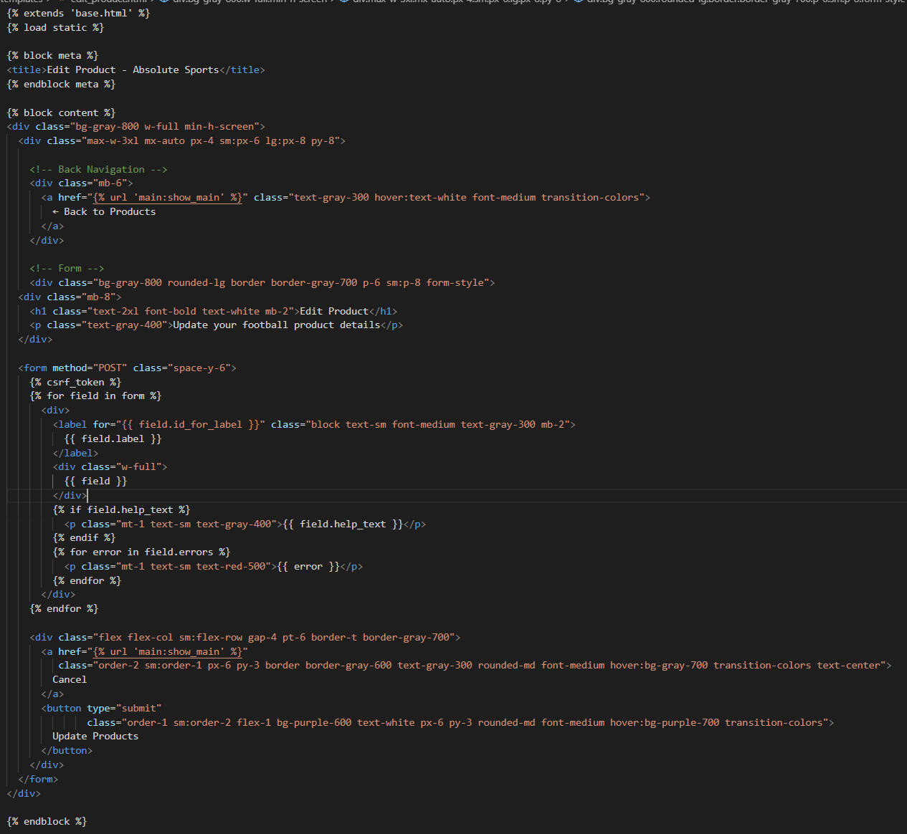

   import fungsi edit_product di `urls.py`, lalu tambahkan path urlnya `path('news/<uuid:id>/edit', edit_news, name='edit_news'),`

   Tambahkan fitur hapus product dengan menambahkan fungsi delete_product di `views.py`
   ```
   def delete_product(request, id):
    product = get_object_or_404(Product, pk=id)
    product.delete()
    return HttpResponseRedirect(reverse('main:show_main'))
   ```

   import delete_news ke `urls.py` dan tambahkan path urlnya `path('news/<uuid:id>/delete', delete_news, name='delete_news'),`

   Selanjutnya, tambahkan navigation bar pada aplikasi. Pertama, buat file HTML bernama navbar.html di folder templates/ di root. isinya adalah
   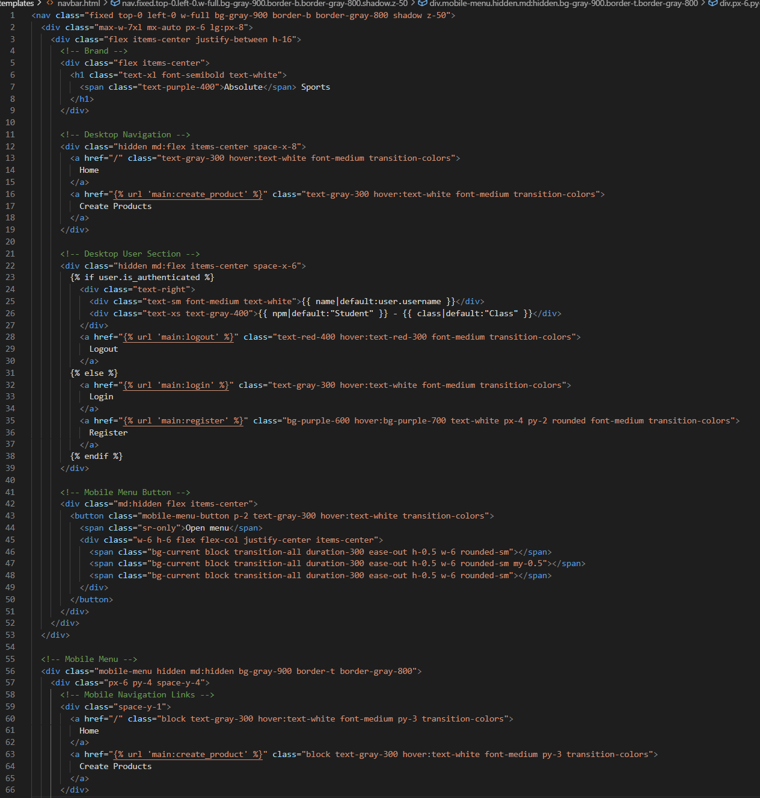
   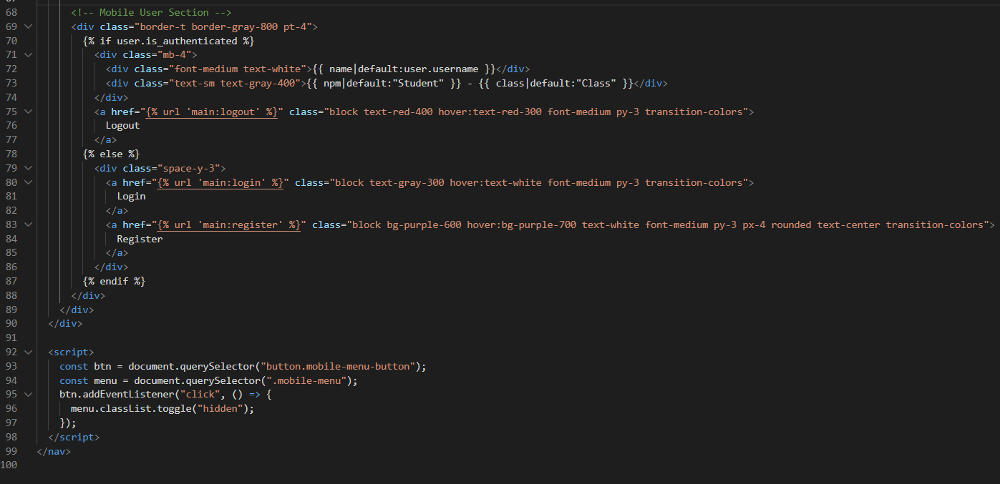

   tambahkan tautan navbar ke main.html

   pada `settings.py` tambahkan middleware WhiteNoise di bawah SecurityMiddleware\
   `'whitenoise.middleware.WhiteNoiseMiddleware',`

   pada `settings.py` pastikan variabel STATIC_ROOT, STATICFILES_DIRS, dan STATIC_URL dikonfigurasikan seperti ini
   ```
   STATIC_URL = '/static/'
   if DEBUG:
      STATICFILES_DIRS = [
         BASE_DIR / 'static'
    ]
   else:
      STATIC_ROOT = BASE_DIR / 'static'
   ```

   lalu tambahkan `global.css` di /static/css di root directory, pada base.html tambahkan global.css
   ```
   
   <!DOCTYPE html>
   <html lang="en">
   <head>
      <meta charset="UTF-8" />
      <meta name="viewport" content="width=device-width, initial-scale=1.0" />
       
      <script src="https://cdn.tailwindcss.com"></script>
      <link rel="stylesheet" href=""/>
   </head>
   <body>
       
   </body>
   </html>
   ```

   lalu, tambahkan styling ke global.css
   ```
   .form-style form input, form textarea, form select {
    width: 100%;
    padding: 0.5rem;
    border: 2px solid #bcbcbc;
    border-radius: 0.375rem;
   }
   .form-style form input:focus, form textarea:focus, form select:focus {
      outline: none;
      border-color: #800080;
      box-shadow: 0 0 0 3px #800080;
   }

   .form-style input[type="checkbox"] {
      width: 1.25rem;
      height: 1.25rem;
      padding: 0;
      border: 2px solid #d1d5db;
      border-radius: 0.375rem;
      background-color: white;
      cursor: pointer;
      position: relative;
      appearance: none;
      -webkit-appearance: none;
      -moz-appearance: none;
   }

   .form-style input[type="checkbox"]:checked {
      background-color: #800080;
      border-color: #800080;
   }

   .form-style input[type="checkbox"]:checked::after {
      content: '✓';
      position: absolute;
      top: 50%;
      left: 50%;
      transform: translate(-50%, -50%);
      color: white;
      font-weight: bold;
      font-size: 0.875rem;
   }

   .form-style input[type="checkbox"]:focus {
      outline: none;
      border-color: #800080;
      box-shadow: 0 0 0 3px rgba(22, 163, 74, 0.1);
   }
   ```

   lalu kita styling masing-masing halaman
   halaman login:
   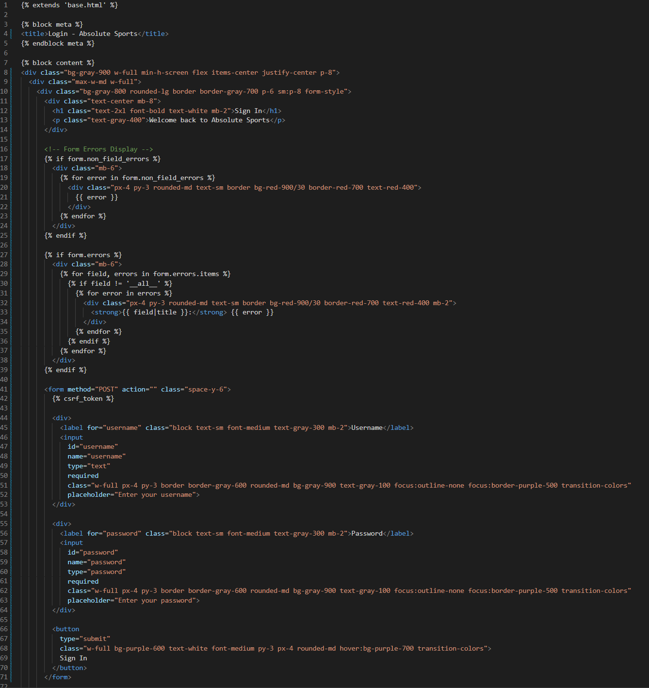
   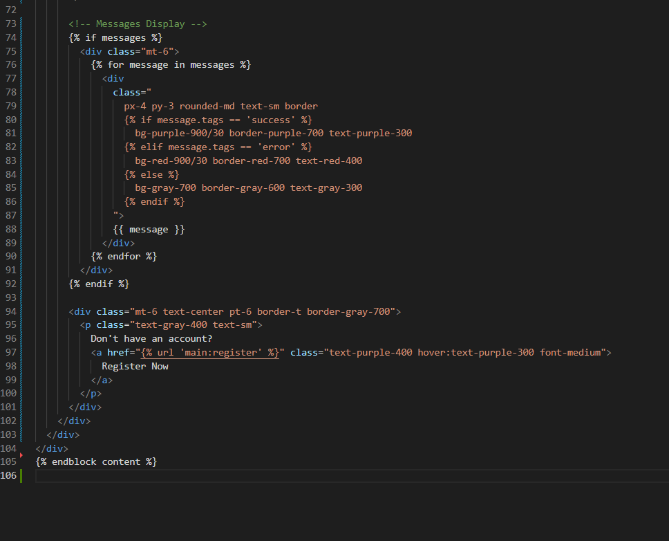

   halaman register:
   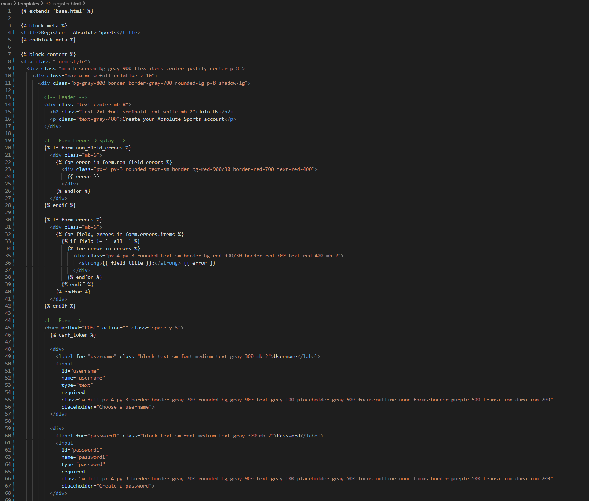
   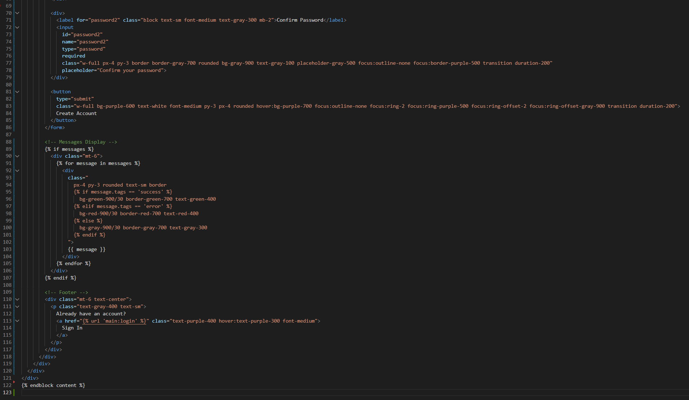

   lalu, untuk home page kita tambahkan file `card_product.html`, yang berisi
   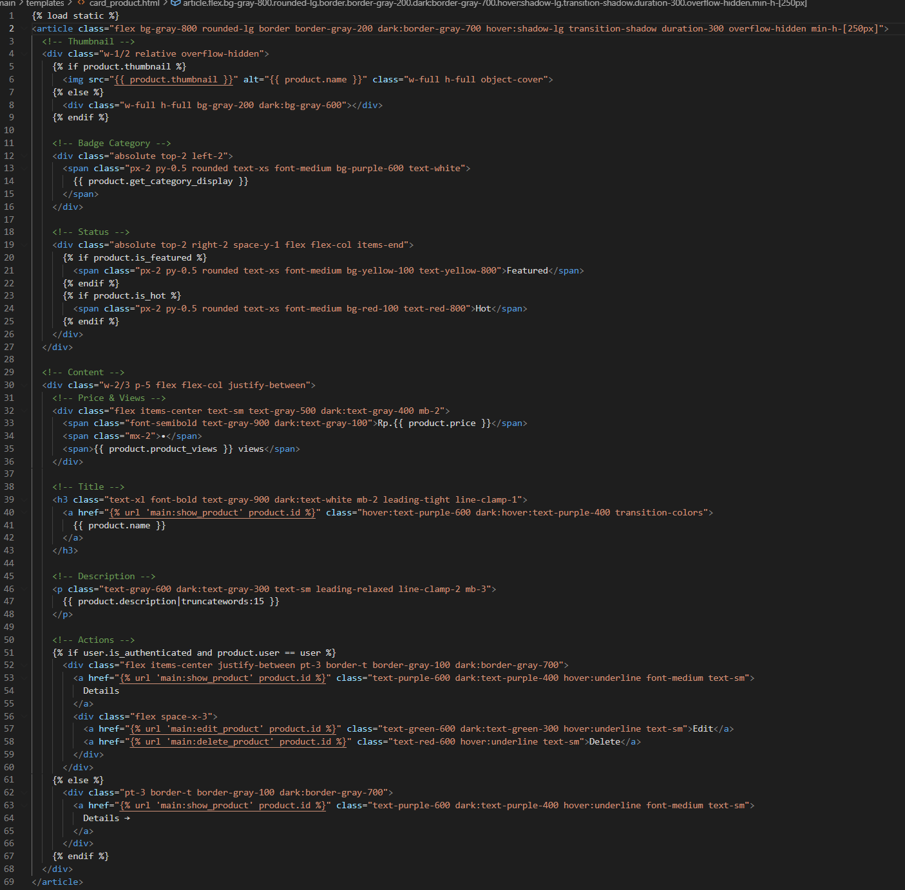

   lalu, karena kita perlu jika kita belum punya product. pilih foto/image dengan nama no-products.png di directory static/image

   Selanjutnya, styling `product_detail.html` 
   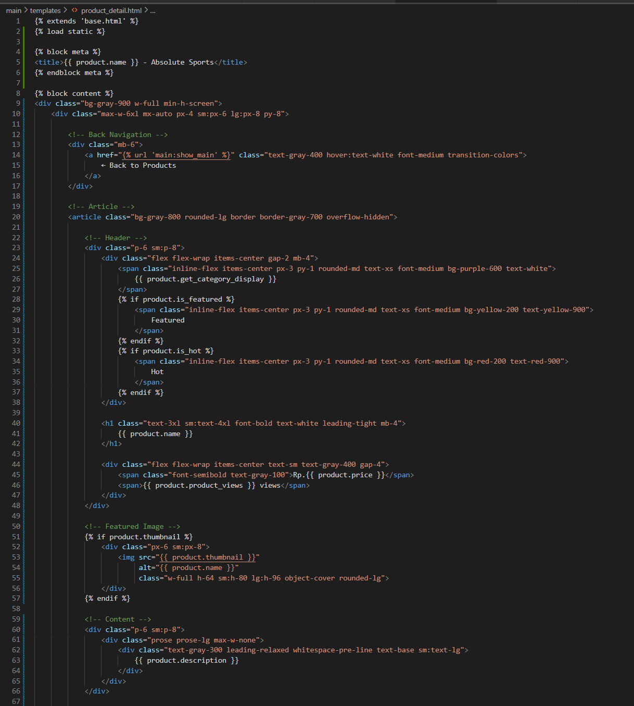
   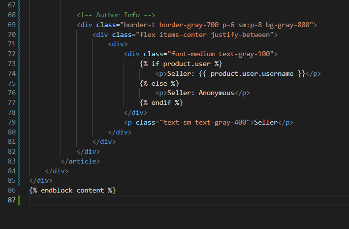

   lalu, halaman create_product.html:
   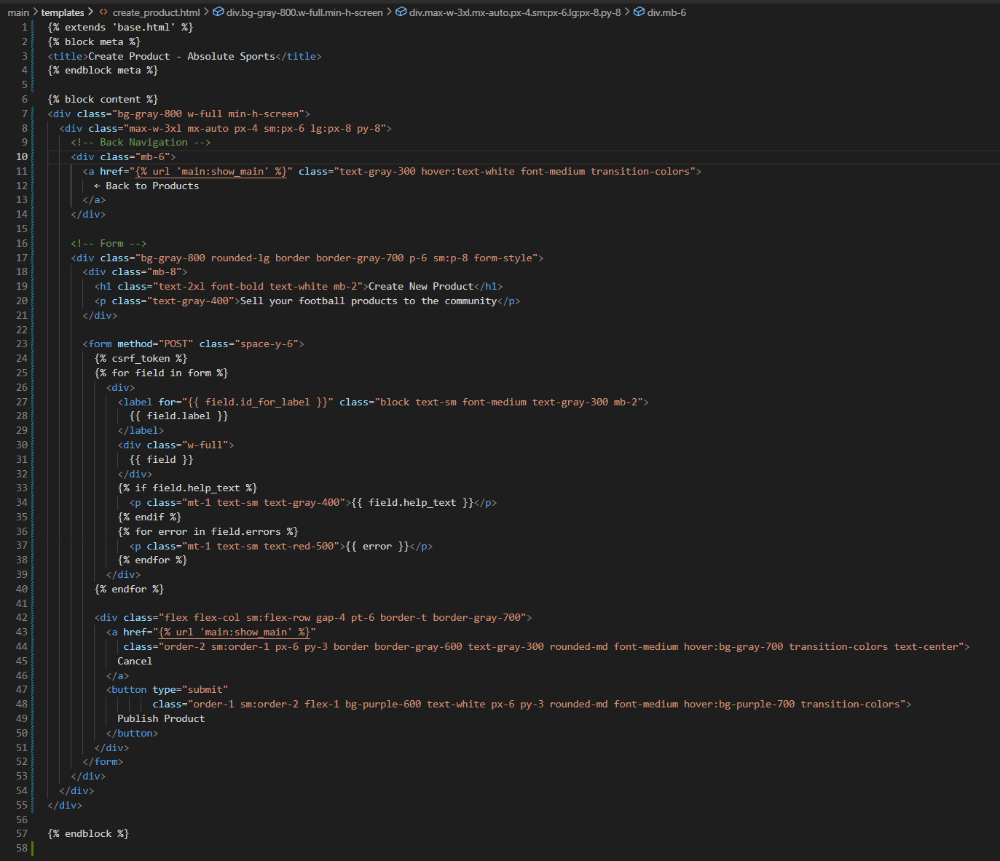

   lalu, halaman `edit_product.html`:
   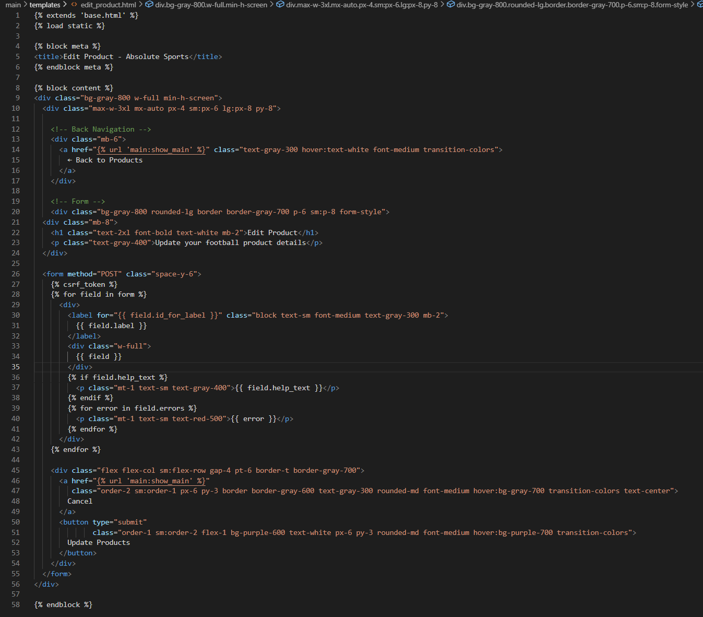

   terakhir, ubah `main.html`:
   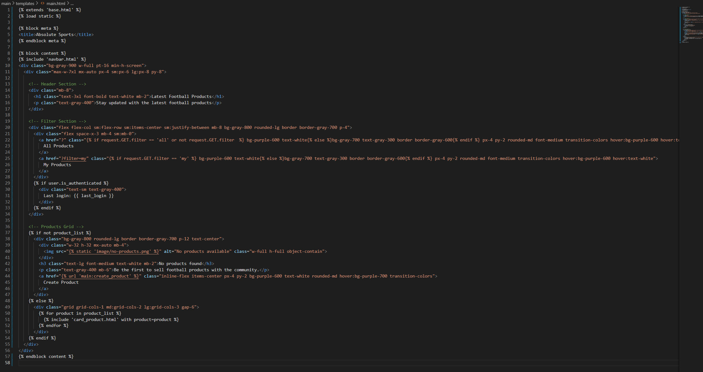


