# Absolute Sports
## Aplikasi football shop saya dapat di akses di link berikut: https://fakhri-husaini41-absolutesports.pbp.cs.ui.ac.id/ 

Nama Aplikasi: Absolute Sports\
Nama: Fakhri Husaini Romza\
NPM: 2406436972\
Kelas: PBP C

### 1. Jelaskan bagaimana cara kamu mengimplementasikan checklist di atas secara step-by-step (bukan hanya sekadar mengikuti tutorial).
   1. Membuat proyek Django
      Saya membuka terminal pada direktori kerja lalu menjalankan perintah `django-admin startproject absolute_sports` untuk membuat struktur proyek dasar. Perintah ini menghasilkan file `manage.py` beserta folder absolute_sports yang berisi file konfigurasi seperti settings.py, urls.py, dan lainnya. Setelah itu, saya membuat virtual environment baru menggunakan `python -m venv venv` dan mengaktifkannya dengan perintah `venv\Scripts\activate`. Langkah berikutnya adalah menginstal Django beserta dependensi lain yang tercantum dalam `requirements.txt` menggunakan perintah `pip install -r requirements.txt`.
      
   2. Membuat aplikasi bernama main
      Setelah berada di dalam direktori proyek, saya menjalankan perintah `python manage.py startapp main` untuk membuat aplikasi baru. Perintah ini menghasilkan sebuah folder bernama main yang berisi beberapa file standar seperti `models.py`, `views.py`, `urls.py`, dan `admin.py` yang nantinya digunakan untuk mengatur logika aplikasi, struktur data, serta konfigurasi admin. Agar aplikasi ini terintegrasi dengan proyek utama, saya menambahkan 'main' ke dalam daftar INSTALLED_APPS di file settings.py. Dengan begitu, Django mengenali aplikasi main sebagai bagian dari proyek dan siap digunakan dalam pengembangan lebih lanjut.
   
   3. Melakukan routing pada proyek agar dapat menjalankan aplikasi main
      Pada file `urls.py` , saya menambahkan konfigurasi routing dengan mengimpor include dari django.urls. Setelah itu, saya menambahkan baris `path('', include('main.urls'))` sehingga setiap permintaan ke root URL diarahkan ke file urls.py milik aplikasi main. Dengan cara ini, rute utama proyek secara otomatis dipetakan ke dalam sistem routing aplikasi main.
   
   4. Membuat model pada aplikasi main dengan nama Product dan memiliki atribut wajib
      di models.py saya definisikan `Product(models.Model)` dengan atribut sebagai berikut:
      ```
      name = models.CharField(max_length=255)
      price = models.IntegerField()
      description = models.TextField()
      category = models.CharField(max_length=20, choices=CATEGORY_CHOICES, default='update')
      thumbnail = models.URLField(blank=True, null=True)
      is_featured = models.BooleanField(default=False)
      ```
      Lalu, Saya menjalankan perintah `python manage.py makemigrations` untuk membuat berkas migrasi berdasarkan model yang telah didefinisikan di aplikasi main. Setelah itu, saya mengeksekusi `python manage.py migrate` agar migrasi tersebut diterapkan ke database.

   5. Membuat fungsi pada views.py untuk dikembalikan ke template HTML yang menampilkan nama aplikasi serta nama dan kelas:
      Di main/views.py, buat fungsi show_main(request):
      ```
      from django.shortcuts import render
      
      def show_main(request):
          context = {
              'npm' : '2406436972',
              'name': 'Fakhri Husaini Romza',
              'class': 'PBP B'
          }

          return render(request, "main.html", context)
      ```

   6. Membuat sebuah routing pada urls.py aplikasi main
      ```
      from django.urls import path
      from main.views import show_main

      app_name = 'main'

      urlpatterns = [
          path('', show_main, name='show_main'),
      ]
      ```

  7. Melakukan deployment ke PWS
     ```
     git add .
     git commit -m "Tugas 2: Django MVT impementations"
     git push origin master
     git push pws master
     ```
### 2. Buatlah bagan yang berisi request client ke web aplikasi berbasis Django beserta responnya dan jelaskan pada bagan tersebut kaitan antara urls.py, views.py, models.py, dan berkas html.
   

1. User mengakses suatu URL tertentu pada browser (request).
2. Django akan memetakan URL (routing) tersebut ke View melalui urls.py.
3. View mengambil dan memproses data dari Model apabila dibutuhkan.
4. Output dari View ditampilkan ke pengguna dengan cara dikirim ke Template (html)

Referensi adalah PPT 03 - MTV Django Architecture:
https://drive.google.com/drive/folders/1St8NywVbAFIgZ1AWCbe6VMmZZj2_BzR_?usp=sharing 
   
### 3. Jelaskan peran settings.py dalam proyek Django!
   settings.py adalah file konfigurasi proyek Django. Peran-perannya adalah:
   1. Pengaturan database
   2. Static files dan template.
   3. Keamanan, seperti SECRET_KEY, DEBUG, ALLOWED_HOSTS
   4. Konfigurasi proyek, seperti nama aplikasi di INSTALLED_APPS, pengaturan middleware, dan pengaturan root URL

### 4. Bagaimana cara kerja migrasi database di Django?
   Migrasi database di Django adalah proses yang menghubungkan perubahan pada model di `models.py` dengan struktur database. Saat developer membuat atau mengubah model, perintah `python manage.py makemigrations` digunakan untuk menghasilkan file migrasi yang berisi instruksi perubahan skema database. Selanjutnya, perintah `python manage.py migrate` mengeksekusi file migrasi tersebut ke database sehingga struktur database selalu selaras dengan definisi model.

### 5. Menurut Anda, dari semua framework yang ada, mengapa framework Django dijadikan permulaan pembelajaran pengembangan perangkat lunak?
   1. Dengan pola MTV (Model-Template-View), Django memudahkan pemula memahami hubungan antara logika aplikasi, pengelolaan data, dan tampilan antarmuka.
   2. Django memiliki banyak fitur bawaan, seperti autentikasi, sistem admin, manajemen URL, dll.
   3. Dokumentasi lengkap.
   4. Django banyak digunakan di industri.

### 6. Apakah ada feedback untuk asisten dosen tutorial 1 yang telah kamu kerjakan sebelumnya?
   Tutorial 1 sangat membantu. catatan-catatan yang ada juga sangat berguna ketika ada error. Penjelasan yang ada juga sudah sangat jelas.


## Tugas 3

### 1. Jelaskan mengapa kita memerlukan data delivery dalam pengimplementasian sebuah platform?
   Data delivery diperlukan karena platform modern hampir lalu bergantung pada pertukaran data antara komponen internal maupun dengan pihak eksternal. Data delivery yang efisien menjamin ketersediaan data tepat waktu. Data delivery yang bagus memastikan komponen-komponen aplikasi berinteraksi dengan lancar. Data delivery juga mencakup enkripsi, autentikasi, dan otorisasi agar data yang dikirim tidak bocor atau diakses pihak yang tidak berwenang.

### 2. Menurutmu, mana yang lebih baik antara XML dan JSON? Mengapa JSON lebih populer dibandingkan XML?
   Menurut saya, JSON lebih baik dibandingkan XML. JSON lebih populer karena strukturnya lebih ringkas dan berbasis key dan value, lebih mudah dibaca, dan ukuran datanya lebih kecil.

### 3. Jelaskan fungsi dari method is_valid() pada form Django dan mengapa kita membutuhkan method tersebut?
   Fungsi dari `is_valid()` adalah untuk memvalidasi form, mengecek apakah semua field pada form diisi dengan benar sesuai aturan, jika error akan return False. Method `is_valid()` juga mengisi `cleaned_data` yang berisi data input yang sudah dibersihkan dan siap dipakai. Method is_valid() juga menangani error handling.

### 4.  Mengapa kita membutuhkan csrf_token saat membuat form di Django? Apa yang dapat terjadi jika kita tidak menambahkan csrf_token pada form Django? Bagaimana hal tersebut dapat dimanfaatkan oleh penyerang?
   csrf_token adalah token unik yang dibuat Django dan disematkan pada setiap form HTML. Fungsi dari csrf_token adalah untuk mencegah serangan Cross-Site Request Forgery. Jika tidak menambahkan csrf_token, maka Form Django tidak terlindungi dari serangan CSRF. Penyerang dapat memanfaatkan kelemahan itu dengan melakukan serangan CSRF, misalnya pada aplikasi e-banking, user sudah login ke aplikasi, penyerang membuat halaman berisi form palsu di website lain, user tanpa sadar mengunjungi halaman milik penyerang, form palsu terkirim ke server bank dengan cookie session milik user, akhirnya uang user akan terkirim ke rekening penyerang.

### 5. Jelaskan bagaimana cara kamu mengimplementasikan checklist di atas secara step-by-step (bukan hanya sekadar mengikuti tutorial).
   Checklist 1:
   Mengimport `HttpResponse` dan `Serializer`
   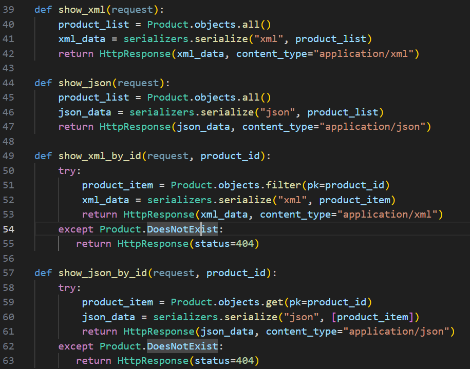
   Lalu, buat fungsi-fungsinya.
   di `urls.py` pada direktori main import fungsi-fungsi yang sudah dibuat 
   `from main.views import show_main, create_product, show_product, show_xml, show_json,  show_xml_by_id, show_json_by_id`
   Tambahkan path url ke urlpatterns agar bisa mengakses fungsi yang sudah diimpor.

   
   Checklist 2:
   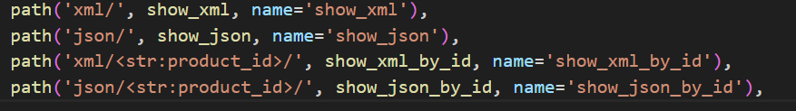

   Checklist 3-5:
   Sebelum membuat form, harus membuat skeleton terlebih dahulu. Pertama, buat direktori templates pada direktori utama dan buat file `base.html`, isi dari base.html adalah:
   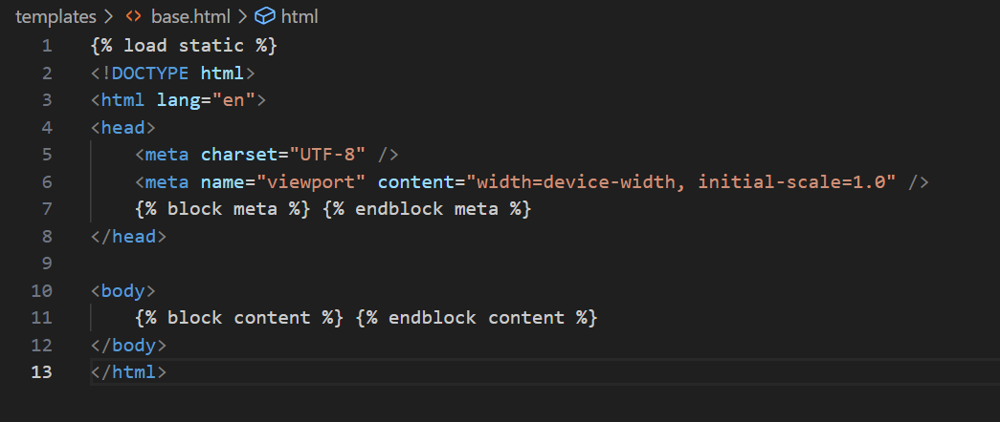

   Buka settings.py pada direktori proyek, lalu tambahkan pada `TEMPLATES` `'DIRS': [BASE_DIR / 'templates']`

   Untuk membuat form input, buat file baru di main bernama `forms.py`, isi forms.py adalah:
   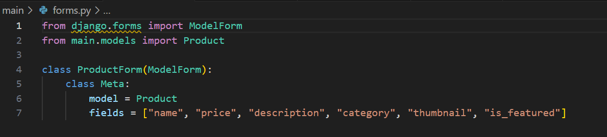

   Sesuaikan fields main.models, model, dan fields dengan `models.py`

   Buka file `views.py` pada direktori `main` dan tambahkan import dan fungsi-fungsi:
   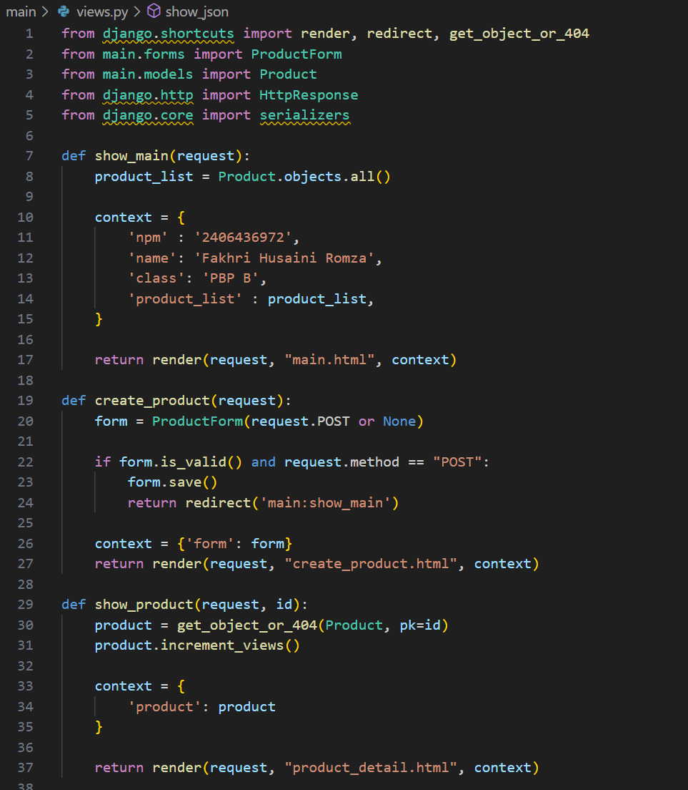

   Buka `urls.py` pada main, import fungsi-fungsi dan tambahkan path URL ke urlpatterns:
   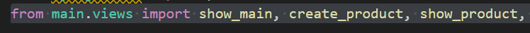
   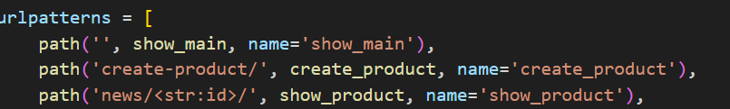

   Buka `main.html` di direktori `main/templates` dan tambahkan blok content data product dan tombol Add Product:
   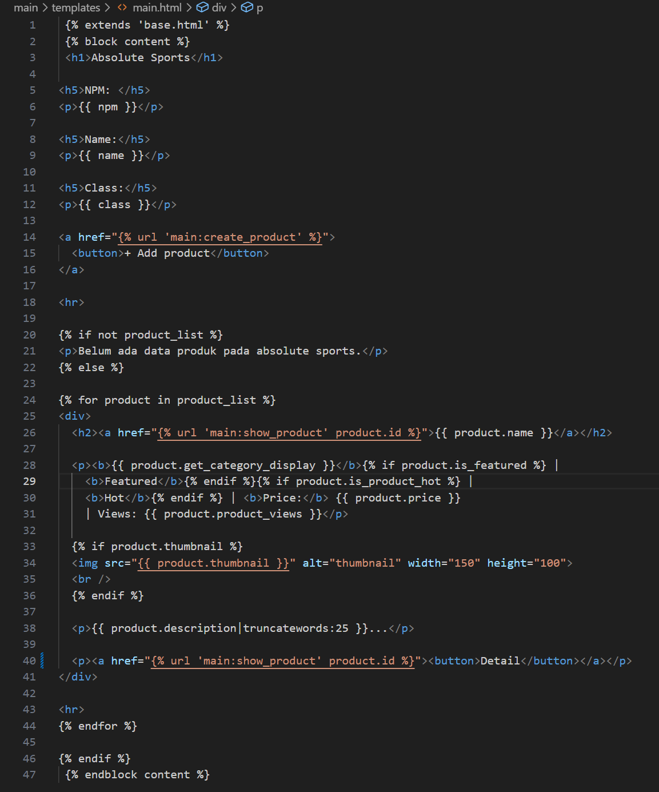

   Lalu buat dua berkas HTML, `create_product.html` dan `product_detail.html`, pada direktori `main/templates` 
   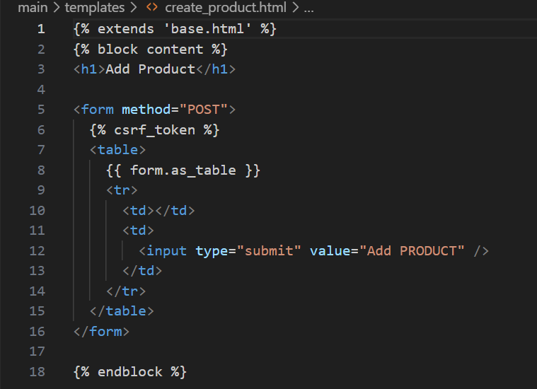
   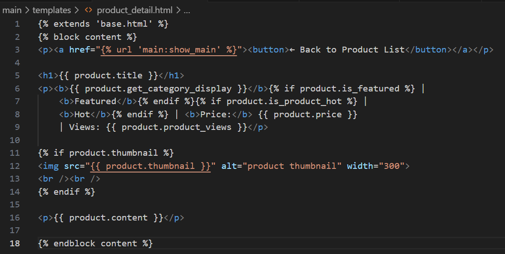

   Buka settings.py di root, lalu tambahkan `CSRF_TRUSTED_ORIGINS` tepat setelah `ALLOWED_HOSTS`
   tambahkan url proyek pws:
   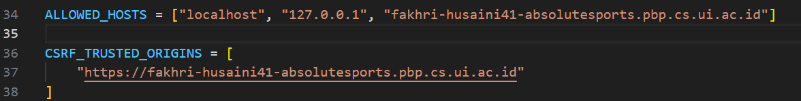

   Yang membedakan dari tutorial adalah saya mengganti fungsi `created_at` dengan `price` di `main.html` dan `product_detail.html` 
   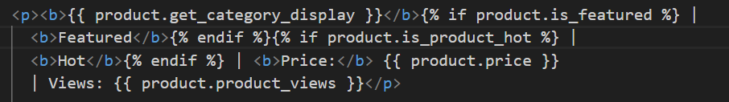

   Saya juga mengubah semua `News` atau `news` dengan `Product` atau `product`
   
### 6. Apakah ada feedback untuk asdos di tutorial 2 yang sudah kalian kerjakan?
   Tutorial sudah sangat bagus. Semua penjelasan dapat dipahami dengan mudah dan runtut.

### 7. Mengakses keempat URL di poin 2 menggunakan Postman,
   JSON:
   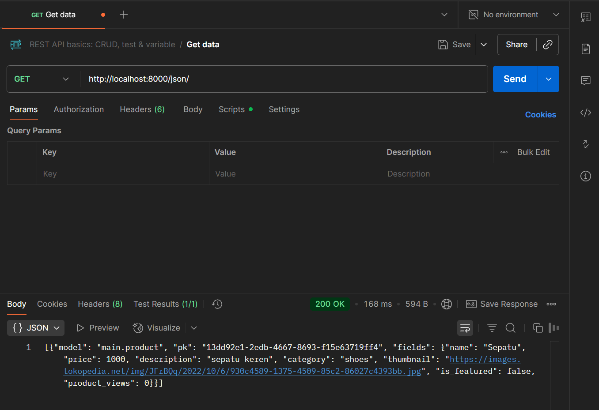

   XML: 
   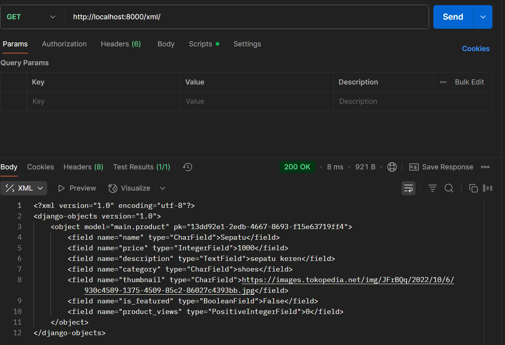

   JSON by id:
   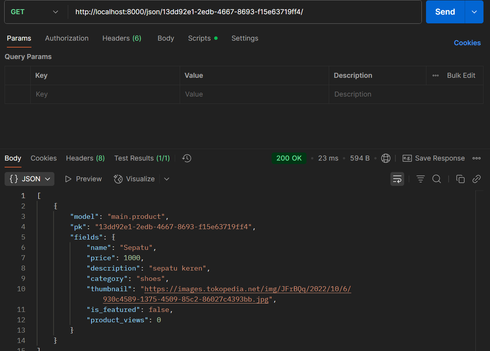

   XML by id:
   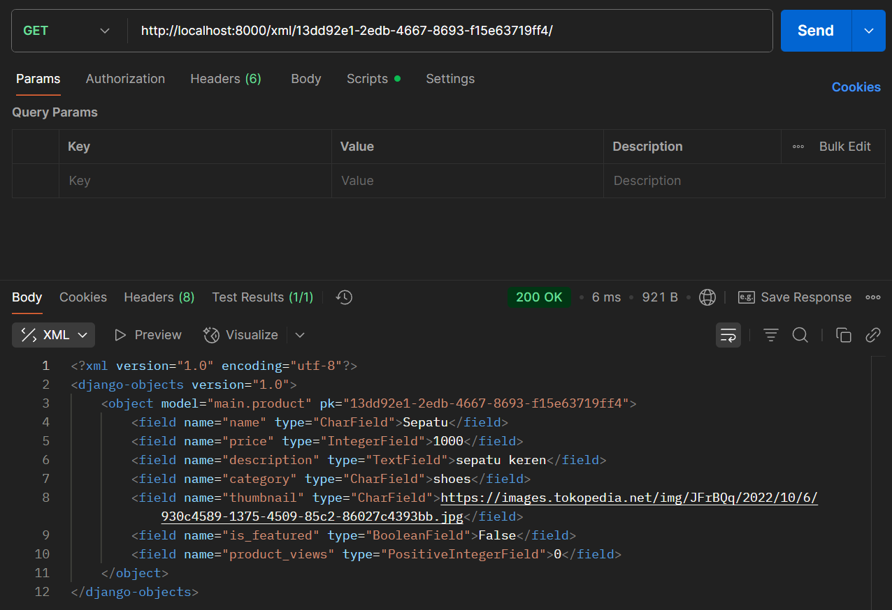